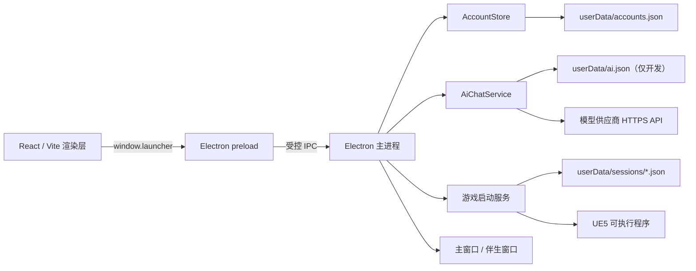
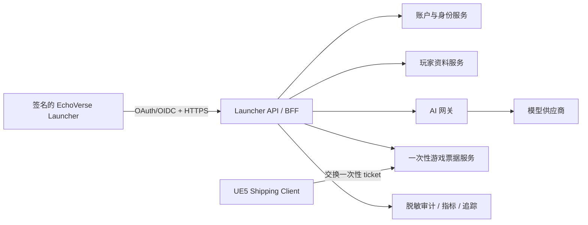

# EchoVerse Launcher 架构

本文描述当前 Windows 启动器原型的运行边界，并给出向生产平台演进时必须保留的接口边界。当前实现是 Electron + React 单机应用，不是完整的平台后端。

## 当前运行结构



### 进程责任

| 边界 | 责任 | 禁止事项 |
| --- | --- | --- |
| React 渲染层 | 页面、表单、本地交互状态、3D 展示、用户可见错误 | 不直接访问 Node.js、文件系统、密钥或启动外部进程 |
| Preload | 暴露最小、类型明确的 `window.launcher` API | 不暴露通用 `ipcRenderer`、文件系统或任意通道调用 |
| Electron 主进程 | 窗口生命周期、IPC 校验、账户/AI/游戏服务编排 | 不信任渲染层输入，不把密钥或密码返回给渲染层 |
| AccountStore | 输入规范化、密码哈希、资料不可变规则、本地持久化 | 不承担生产身份认证或多设备同步 |
| AiChatService | 人格提示构造、历史截断、供应商请求、超时与状态 | 不在日志或错误中输出密钥；生产版不应直连供应商 |
| 游戏启动服务 | 读取配置、创建短时会话文件、启动 UE5、清理文件 | 不向 UE5 传递密码或模型密钥 |

## 源码结构

```text
electron/
  main.ts            Electron 生命周期、IPC、窗口与游戏启动
  preload.ts         渲染层允许调用的最小 API
  auth-service.ts    本地账户和 AI Agent 档案
  ai-service.ts      人格提示与模型供应商适配
src/
  App.tsx            根流程：普通窗口或伴生窗口
  components/        标题栏、通用 UI、错误边界与 3D 场景边界
  pages/             账户、主页、世界、社交、分身、聊天和个人主页
  dev/               仅开发环境使用的预览账户
  AvatarViewport.tsx Three.js / GLB 虚拟分身渲染
  auth.ts / ai.ts    渲染层类型化业务客户端
  styles.css         当前全局界面样式
contracts/
  launcher-session.schema.json  启动器到 UE5 的版本化契约
scripts/
  test-*.cjs         账户、AI、契约和资产门禁
docs/
  UE5_GAME_HANDOFF.md 游戏端接入要求
public/models/
  ecy-avatar.glb     临时虚拟分身资产
```

根应用已按产品领域拆分，`App.tsx` 只负责顶层流程。`styles.css` 仍是较大的全局样式入口；后续应按 shell、account、world、social、avatar、profile 和 chat 拆分，并为页面状态保留、组件测试与可访问性建立统一规范。IPC 仍只允许通过类型化客户端模块访问。

## 关键流程

### 注册与首次资料

1. 渲染层提交昵称、邮箱和密码。
2. 主进程验证 IPC 来自主窗口的顶层可信页面。
3. `AccountStore` 规范化邮箱、校验输入并串行执行账户写操作。
4. 密码使用随机盐和 `scrypt` 生成哈希；新账户同时获得唯一 Agent ID。
5. 首次资料保存后，非空字段成为不可修改字段；后续只能补充原本为空的字段和剩余爱好槽位。
6. 结构化资料同步到 Agent 档案，Agent 状态从 `WAITING_FOR_PROFILE` 变为 `READY`。

单实例内的账户操作由队列串行化，避免并发注册基于同一旧快照覆盖数据。该保证不适用于多个进程或多台设备；生产版必须由数据库唯一约束和事务提供一致性。

### 本地账户持久化

- 主文件：`app.getPath('userData')/accounts.json`
- 上一次有效副本：`accounts.json.bak`
- 写入：先写同目录临时文件，再原子替换主文件
- 数据库版本：`1`

账户文件包含个人资料和密码哈希，仍属于敏感数据。备份不是完整的灾难恢复方案，也不提供加密、跨设备同步或密钥轮换。

### AI 人格对话

1. 渲染层只提交当前消息和最近会话历史。
2. 主进程根据当前登录用户获取 Agent 档案。
3. 服务将显示名、性别、职业、人格和非敏感偏好转换为系统人格提示；真实姓名、精确生日、居住地和信仰默认保持本地。
4. 历史条数和单条长度受限，请求有超时控制。
5. 开发配置选择 DeepSeek Chat Completions 或 OpenAI Responses 适配器；每账户 Agent 档案独立，基础模型可以共享。
6. 供应商响应被转换成统一的 `{ text, responseId, model }` 结果。

当前开发配置位于用户数据目录，客户端仍能读取供应商密钥。生产架构中此步骤必须改为调用 EchoVerse AI 网关，并只向网关发送完成当前功能所需的最少字段。

### UE5 游戏启动

1. 主进程读取开发游戏配置。
2. 创建符合 `contracts/launcher-session.schema.json` 的会话文件。
3. 通过命令行参数传递会话文件路径、契约版本和 Launch ID。
4. 以隐藏控制台、分离进程方式启动 UE5。
5. 游戏退出、启动失败或会话过期后清理文件。

当前 `prototype-local` ticket 只用于 Development 联调。完整字段与游戏端验收规则见 `docs/UE5_GAME_HANDOFF.md`。

### 伴生模式

主窗口和透明伴生窗口属于同一个 Electron 主进程。主进程持有当前登录用户，并向伴生窗口返回显示名、Agent 状态和强调色的最小状态。伴生窗口不应获得账户邮箱、完整资料、聊天历史或密钥。

## 信任边界与不变量

- 渲染层始终视为不可信输入源，即使页面来自本地构建。
- 所有敏感 IPC 必须验证窗口、顶层 Frame 和可信 Origin/文件 URL。
- `contextIsolation` 与 `sandbox` 保持开启，`nodeIntegration` 保持关闭。
- 禁止新窗口、非预期导航、WebView 和默认权限请求。
- 密码、密码哈希、盐、API Key 和游戏 ticket 不得进入 React 状态或遥测。
- 已完成的现实资料非空字段不可被覆盖；任何新写路径都必须复用同一领域规则。
- Agent 必须属于当前账户，游戏会话中的 `account` 与 `agent` 不得从渲染层自由拼装。
- 生产构建不得包含 `config/*.local.json`、账户文件、会话文件或聊天数据。
- Launcher Session 的不兼容变更必须升级 `contractVersion`，不能静默改变 `1.0` 语义。

## 目标生产架构



生产演进应保持桌面客户端为“受限展示与启动外壳”：

- 身份服务负责注册、验证、密码重置、MFA、会话撤销和风控。
- 资料服务负责字段权限、版本、导出、删除和保留策略。
- AI 网关负责供应商密钥、模型路由、限流、内容安全、字段最小化和费用控制。
- ticket 服务签发短时一次性凭证，并由 UE5 通过后端交换游戏会话。
- 桌面端只保存可撤销的短期令牌，优先使用 Windows Credential Manager 等系统凭据存储。

## 架构变更规则

以下变更必须同时更新测试和文档：

- 新增或改变 IPC 通道：更新 preload 类型、来源校验和负向测试。
- 改变账户/Agent 字段：提供数据库迁移、回滚和旧数据夹具。
- 改变 Launcher Session：更新 JSON Schema、契约测试和 UE5 交接文档。
- 新增外部网络服务：记录发送字段、超时、重试、限流、隐私与故障降级。
- 替换 3D 资产：通过资产门禁，并记录来源、许可、版本和性能预算。
- 新增本地文件：明确位置、敏感级别、权限、清理和迁移策略。
